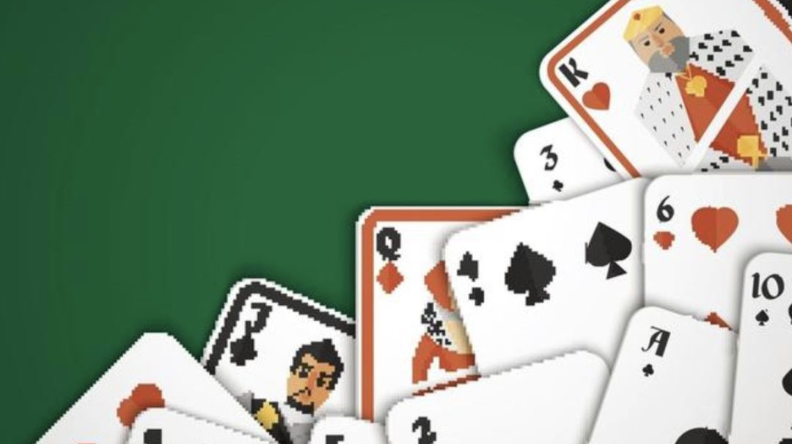
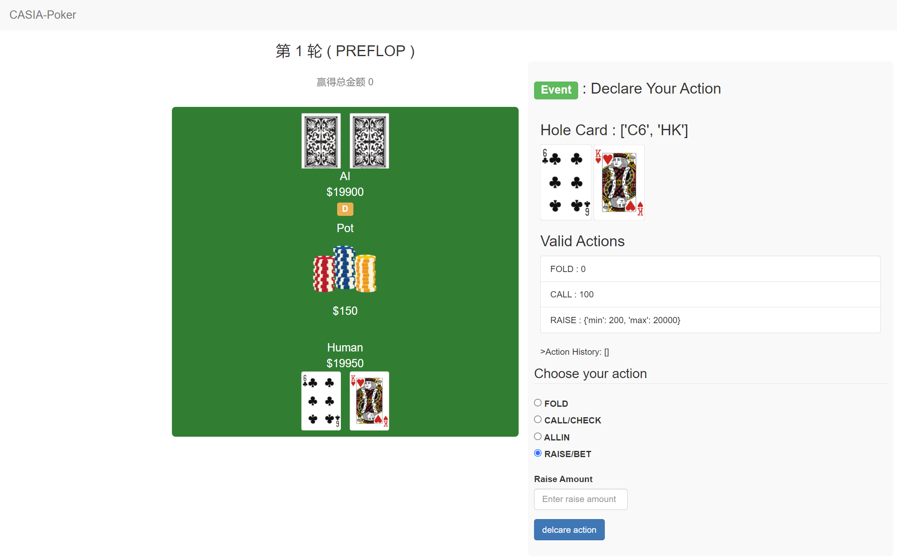
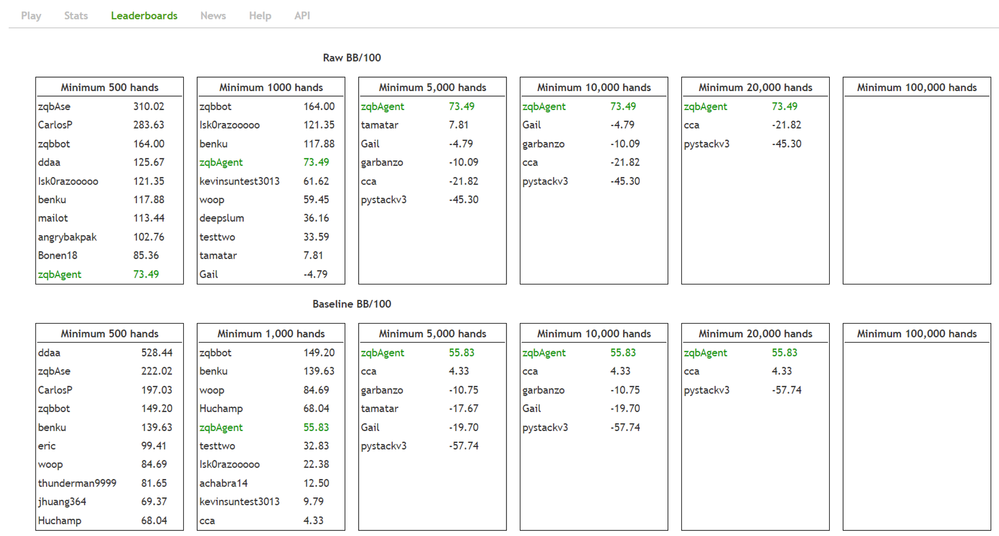
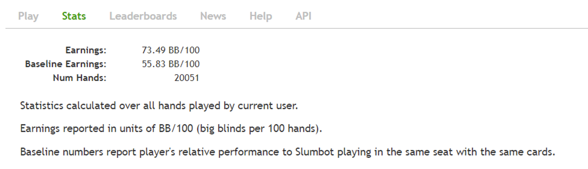
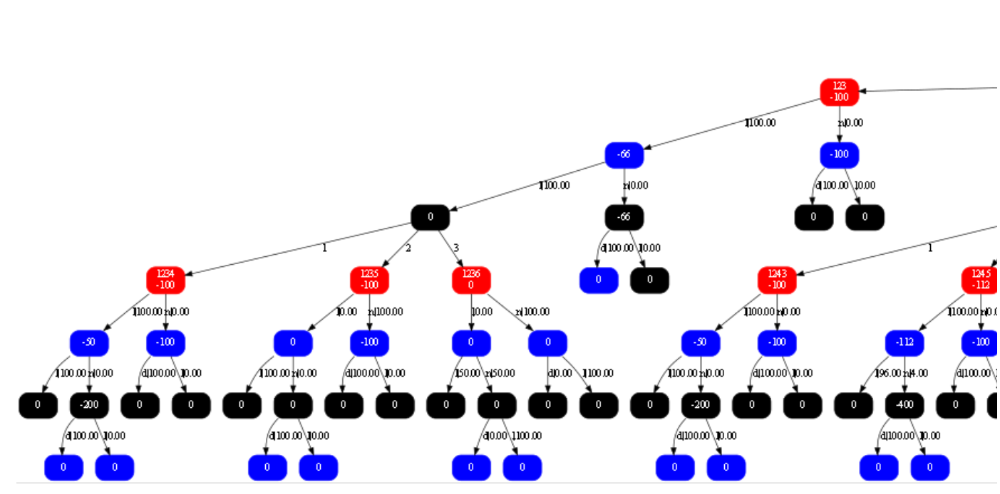

# DecisionHoldem

An imperfect information game is a type of game with asymmetric information. Compared with perfect information game, imperfect information game is more common in life. Artificial intelligence in imperfect games like poker has made significant progress and success in recent years. The great success of Superhuman Poker AI, such as Libratus and Deepstack, attracts researchers to pay attention to poker research. However, the lack of open source code limits the development of Texas Hold'em AI to some extent. 

This project introduces DecisionHoldem, a high-level AI for heads-up no-limit Texas hold'em with safer depth-limited solving with diverse opponents ranges to reduce the exploitability of the strategy.DecisionHoldem is mainly composed of two parts, namely the blueprint strategy and the real-time search part. 

In the blueprint strategy part, DecisionHoldem first employs the hand abstraction technique and action abstraction to obtain an abstracted game. Then we used the linear CFR algorithm iteration on the abstracted game tree to calculate blueprint strategy on a workstation with 48 core CPUs for 3 - 4 days. The total number of iterations is about 200 million. 

In the real-time search part, we propose a safer depth-limited solving algorithm than modicum's depth-limited solving algorithm on subgame by putting more possible ranges of opponent private hands into consideration for off-tree nodes. This algorithm can significantly improve the AI game level by reducing the exploitability of the strategy. The details of the algorithm will be introduced in subsequent articles soon.

To evaluate the performance of DecisionHoldem, we play it against Slumbot and OpenStackTwo, respectively. Slumbot is the champion of the 2018 Anual Computer Poker Competition and the only high-level poker AI currently available. About 20,000 games against Slumbot, DecisionHoldem's average profit is more remarkable than 730mbb/h, and it ranked first in statistics on November 26, 2021 (DecisionHoldem's name on the ranking is zqbAgent[2,3]). OpenStackTwo built-in OpenHoldem Texas Hold'em Confrontation Platform is a reproduced version of DeepStack. With about 2,000 games against OpenStack[1], DecisionHoldem's average profit is more excellent than 700mbb/h. 


To promote artificial intelligence development in imperfect-information games,  we have open-sourced the relevant code of DecisionHoldem with tools for playing against the Slumbot, OpenHoldem and human[5]. Meanwhile, we provide [a simple program about Leduc poker](https://github.com/zqbAse/PokerAI_Sim), which helps to understand the algorithm framework and its mechanism.




## Blueprint Strategy

### Requirements
* For C++11 support
* GraphViz software

### Installation
1. Clone repositories:
```
$ git clone https://github.com/AI-Decision/DecisionHoldem.git
```
2. copy followed file to DecisionHoldem/PokerAI/cluster
```
sevencards_strength.bin
preflop_hand_cluster.bin
flop_hand_cluster.bin
turn_hand_cluster.bin
river_hand_cluster.bin
blueprint_strategy.dat
```
These data can be obtained through Baidu Netdisk.
```
Link: https://pan.baidu.com/s/157n-H1ECjEryAx0Z03p2_w
Extraction code: q1pv
```


## Training Blueprint Strategy
* Compile and Run:
```shell
$ cd DecisionHoldem/PokerAI
$ g++ Main.cpp -o Main.o -std=c++11 -mcmodel=large -lpthread
$ ./Main.o 0
```
* When training is finished, getting blueprint strategy "blueprint_strategy.dat" in DecisionHoldem/PokerAI/cluster.

## Evaluation for Blueprint Strategy
* Best Response:
```shell
$ cd DecisionHoldem/PokerAI
$ g++ Main.cpp -o Main.o -std=c++11 -mcmodel=large -lpthread
$ ./Main.o 1
```

## Interface For Holdem Game
AlascasiaHoldem.so and blueprint.so provides a interface for the agent to play with other agent or human in real game scenario.
* AlascasiaHoldem.so  
It plays with real search.
* Blueprint.so  
It only uses the blueprint strategy to play.

# Human Against Agent
GUI application refer to [PyPokerGUI](https://github.com/ishikota/PyPokerGUI).  
* Run:
```shell
$ cd DecisionHoldem/PokerAI/
$ python DecisionHoldem/pypokergui/server/poker.py 8000
```
Tt is necessary that AlascasiaHoldem.so is in directory "DecisionHoldem/PokerAI/".
## Result
[localhost:8000]()


## Slumbot Against Agent
[https://www.slumbot.com/#](https://www.slumbot.com/#)   
<!-- Results on November 26, 2021, DecisionHoldem registered as zqbAgent and ranked first in the leaderboard. -->
Results on Slumbot, DecisionHoldem registered as zqbAgent and ranked first in the leaderboard.
* Run:
```shell
$ cd DecisionHoldem/PokerAI/
$ python DecisionHoldem/pypokergui/play_with_slumbot.py
```




## OpenStackTwo Against Agent
[http://holdem.ia.ac.cn/#/battle](http://holdem.ia.ac.cn/#/battle)
* Run:
```shell
$ cd DecisionHoldem/PokerAI/
$ python DecisionHoldem/pypokergui/play_with_ia_v4.py 888891 2 Bot 2000 OpenStackTwo
```
The Agent_against_OpenStackTwo file contains the information for each game in 2000 games, including the each action probability of our agent, opponents actions and game state.

## PokerAI Project Frameworks
```
├── Poker            # game tree code
│   ├── Node.h              # data structure of every node in game tree
│   ├── Bulid_Tree.h        # traverse every possible hole card, community cards and legal actions to bulid the game tree
│   ├── Exploitability.h    # it compute the exploitability of game tree policy
│   ├── Save_load.h         # it can save game tree policy to a file and load file to bulid a game tree
│   └── Visualize_Tree.h    # Visualize game Tree
│
├── util            # 
│   ├── Engine.h            # it compute game result, judging win person and the person can get the number of chips and get the cluster of the player's hand
│   ├── Exploitability.h    # compute the strategy of best response
│   ├── ThreadPool.h        # Multithread control
│   └── Randint.h           # the class is to generate random number
│
├── Poker           # the foundation class of the poker game
│   ├── Card.h              # every card class, it's id range from 0 to 51
│   ├── Deck.h              # deck class of cards, it contains 52 cards
│   ├── Player.h            # player class,it's attributes contain initial chips, bet chips, small or big blind
│   ├── Table.h             # it's attributes contain players, pot and deck
│   └── State.h             # it is game state, contain every players infoset, legal actions
│
├── Depth_limit_Search.h # it is a algorithm of real time searching in each subgame 
├── Multi_Blureprint.h   # it is a blueprint mccfr algorithm which running with the multithread
└── BlueprintMCCFR.cpp   # it is a blueprint mccfr algorithm which running with the single thread
```

## The Detail of BlueprintMCCFR.h
##### blueprint_cfr function
* MCCFR algorithm for training the blueprint strategy.
##### blueprint_cfrp function
* MCCFR prune algorithm for training the blueprint strategy.
##### dfs_discount function
* discount the regret value.
##### update_strategy function
* update the average strategy of blueprint
## Visualize Game Tree
* After running the function of visualizationsearch(root, "blueprint_subnode.stgy"), current folder will generate a 'blueprint_subnode.stgy' file.
```shell
$ cd GraphViz/bin
$ dot -Tpng blueprint_subnode.stgy > temp.png
```
## Game tree example


## Related projects
GUI is based on a project which can be found here:
https://github.com/ishikota/PyPokerGUI  
demo project:
https://github.com/zqbAse/PokerAI_Sim


# Note 
[1] www.holdem.ia.ac.cn  
[2] www.slumbot.com  
[3] https://github.com/ericgjackson/slumbot2017/issues/11  
[4] Development Environment：A workstation with an Intel(R) Xeon(R) Gold 6240R CPU, and 512GB of RAM.  
[5] Currently some source codes only provide compiled files, and they will be open sourced in the near future. 

# Authors

The project leader is [Junge Zhang](http://people.ucas.edu.cn/~ZHANGJUNGE?language=en) , and the main contributors are [Dongdong Bai](https://scholar.google.com/citations?user=qzJf6lkAAAAJ&hl=zh-CN&oi=ao) and Qibin Zhou.  [Kaiqi Huang](https://scholar.google.com/citations?user=caQ-OmYAAAAJ&hl=zh-CN&oi=ao) co-supervises this project as well. In recent years, this team has been devoting to reinforcement learning, multi-agent system, decision-making intelligence. 

If you use DecisionHoldem in your research, please cite the following paper.

```
@article{zhou2022decisionholdem,
  title={DecisionHoldem: Safe Depth-Limited Solving With Diverse Opponents for Imperfect-Information Games},
  author={Zhou, Qibin and Bai, Dongdong and Zhang, Junge and Duan, Fuqing and Huang, Kaiqi},
  journal={arXiv preprint arXiv:2201.11580},
  year={2022}
}
```

## License
[GNU Affero General Public License v3.0](LICENSE)

